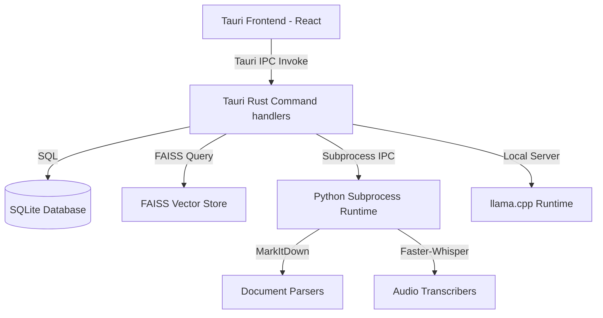

# Architecture Guide — ORVIKA AI

ORVIKA AI is a cross-platform desktop application built on Tauri 2.x, React, TypeScript, and a local Python subprocess runtime.

## Component Overview

## RAG & Search Pipeline
1. **Upload**: React frontend receives drag-and-drop document.
2. **Parse**: Rust commands spawn the Python MarkItDown helper to produce clean Markdown.
3. **Chunk**: Paragraphs are chunked with overlap.
4. **Embed**: Sentence-Transformers computes embeddings.
5. **Index**: Embeddings are inserted into the FAISS index.
